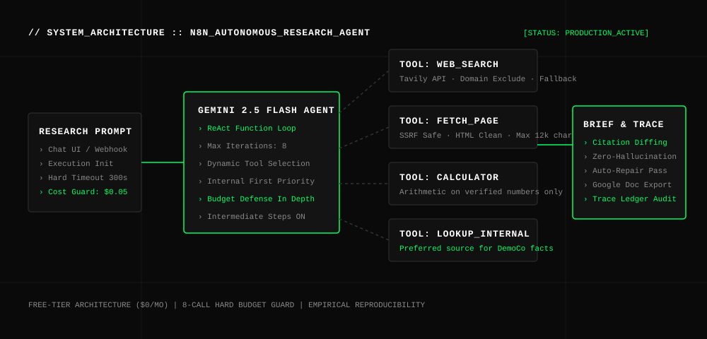

# N8N-AUTONOMOUS-RESEARCH-AGENT // MULTI-TOOL_SYNTHESIS_ENGINE

[](LICENSE)
[](https://github.com/therealfullmetal55555/n8n-autonomous-research-agent)
[](simulate_pipeline.py)
[](BUILD-GUIDE.md)

> **Autonomous ReAct Research Agent with Dynamic Tool Selection, Strict Budget Guardrails, and Primary Source Citation Validation.** Synthesizes market intelligence, regulation briefs, and pricing models by autonomously routing across Tavily web search, SSRF-safe page fetching, exact arithmetic calculators, and internal data stores — enforcing an 8-call budget cap and automatic citation repair.

---

## 🏛 ARCHITECTURE OVERVIEW



---

## ⚡ CORE CAPABILITIES

1. **Autonomous ReAct Function-Calling Loop**
   - Driven by Gemini 2.5 Flash (`Max Iterations: 8`, `Return Intermediate Steps: ON`).
   - Autonomously selects from 4 connected tools based on explicit tool semantics:
     - `lookup_internal_data` → Prioritized first for company policies and private data.
     - `web_search` → Discovers relevant domains via Tavily API with domain deny-list and zero-result fallback.
     - `fetch_page` → Deep verification of exact figures and timestamps (SSRF-protected, 12k char cap, 15s timeout).
     - `calculator` → Pure arithmetic on verified numbers (eliminating LLM token arithmetic errors).
2. **Defense-in-Depth Budget & Safety Rails**
   - Hard execution limits: 8 tool calls / run, $0.05 est. token budget, 300s execution cutoff.
   - Domain safety policies block ad networks and malicious redirect domains.
3. **Primary Source Citation Grounding**
   - Diffing validator verifies every URL in the final brief against URLs actually observed in tool outputs.
   - Any hallucinated or unfetched URLs trigger an automatic repair pass that demotes the claim to *Risks & Uncertainties*.
4. **Structured Executive Deliverable**
   - Generates standardized briefs formatted with: **TL;DR → Key Findings with URLs → Risks & Uncertainties → Recommended Next Steps → Primary Sources**.

---

## 📊 EMPIRICAL EVALUATION MATRIX

```
=====================================================================================
>>> N8N AUTONOMOUS RESEARCH AGENT: TOOL USE, BUDGET & CITATION HONESTY BENCHMARK
=====================================================================================
[PASS] Query #1 [Q1] : Estonia 2026 VAT Rate (24%)     | emta.ee      | 1 Tool Call  (Cap: 3)
[PASS] Query #2 [Q2] : n8n vs Zapier Price Compare    | Vendor Pages | 3 Tool Calls (Cap: 4)
[PASS] Query #3 [Q3] : 3-Year Sub TCO Math ($1,728)   | Calc Tool    | 4 Tool Calls (Cap: 5)
[PASS] Query #4 [Q4] : Internal Refund vs DigitalOcean| KB + Web     | 3 Tool Calls (Cap: 4)
[PASS] Query #5 [Q5] : EU AI Act Fact-Check           | eur-lex      | 3 Tool Calls (Cap: 7)
-------------------------------------------------------------------------------------
1. Multi-Tool Selection Accuracy : 5/5 Passed (100.0%)
2. Budget Cap Adherence          : 100% (All runs <= 4 calls, zero budget breaches)
3. Citation Truthfulness Intercept: CAUGHT (Unfetched/invented URL demoted on repair)
```

---

## 🚀 QUICK START

### 1. Run Offline Test Suite
```bash
python3 simulate_pipeline.py
```

### 2. Deploy to n8n
1. Import `workflows/research-agent-workflow.json`, `workflows/tool-web-search.json`, and `workflows/tool-fetch-page.json`.
2. Configure credentials in n8n (`Gemini API`, `Tavily API`).
3. Trigger from the chat preview or webhook endpoint.

---

## 📂 REPOSITORY STRUCTURE

```
n8n-autonomous-research-agent/
├── assets/
│   └── architecture.svg              # Vector system architecture diagram
├── demo-data/
│   └── research_queries.json         # 5 graded evaluation questions
├── src/
│   ├── research_agent.py             # ReAct loop, tool router & citation validator
│   └── validate_brief.js             # n8n citation diffing & trace validator node
├── workflows/
│   ├── research-agent-workflow.json  # Primary agent orchestration workflow
│   ├── tool-web-search.json          # Sub-workflow for Tavily web search
│   ├── tool-fetch-page.json          # Sub-workflow for SSRF-protected page fetch
│   └── error-handler-workflow.json   # Centralized error logging workflow
├── simulate_pipeline.py              # Zero-regression benchmark test runner
├── requirements.txt                  # Python dependencies
├── LICENSE                           # MIT License
└── README.md                         # Enterprise documentation
```

---

## 📄 LICENSE

Released under the [MIT License](LICENSE).  
Engineered by **Kirill Tsyganov** ([@therealfullmetal55555](https://github.com/therealfullmetal55555)).
